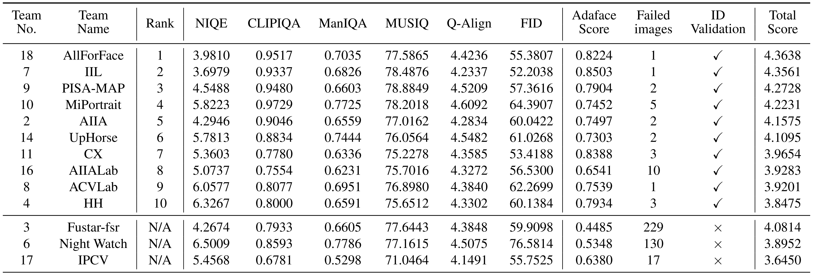

# [NTIRE 2025 Challenge on Real-World Face Restoration](https://cvlai.net/ntire/2025/) @ [CVPR 2025](https://cvpr.thecvf.com/)

[](https://www.cvlai.net/ntire/2025/)
[](https://arxiv.org/abs/2504.14600)
[](https://github.com/zhengchen1999/NTIRE2025_RealWorld_Face_Restoration/releases/download/supp/NTIRE.2025.Real-World.Face.Restoration.Supplementary.pdf)
[](https://github.com/zhengchen1999/NTIRE2025_RealWorld_Face_Restoration)
[](https://github.com/zhengchen1999/NTIRE2025_RealWorld_Face_Restoration)

## About the Challenge

This challenge focuses on restoring real-world degraded face images. The task is to recover high-quality face images with rich high-frequency details from low-quality inputs. At the same time, the output should preserve facial identity to a reasonable degree. There are no restrictions on computational resources such as model size or FLOPs. The main goal is to **achieve the best possible image quality and identity consistency**. 
Participants are ranked based on visual quality while ensuring identity similarity above a threshold; final scores combine several no-reference IQA metrics and FID. 

## Challenge results
**Test Set** – 450 low-quality (LQ) images drawn from five real-world subsets (WIDER-Test, WebPhoto-Test, CelebChild-Test, LFW-Test, and CelebA) are provided for evaluation.  
  
**Identity Validation** – Cosine similarity is measured with a pretrained **AdaFace** model. Thresholds: 0.30 (WIDER & WebPhoto), 0.60 (LFW & CelebChild), 0.50 (CelebA). A submission fails if more than ten faces fall below the dataset-specific threshold.  
  
**Metrics** – Valid submissions are scored with six no-reference metrics: **CLIPIQA, MANIQA, MUSIQ, Q-Align, NIQE,** and **FID** (against FFHQ).  
  
**Overall Score**

$$
\text{Score} = \text{CLIPIQA} + \text{MANIQA} + \frac{\text{MUSIQ}}{100} + \max\left(0, \frac{10 - \text{NIQE}}{10}\right) + \frac{\text{QALIGN}}{5} + \max\left(0, \frac{100-\text{FID}}{100}\right). 
$$

**Ranking rule** – Teams are first screened by the identity filter; qualifying entries are ranked descending by the overall score. Minor deviations between Codalab and reproduced scores are tolerated after code verification.  
  
**Resources** – Official evaluation scripts, pretrained models, and baseline code are available in this public repository.  
<p align="center">

</p>

## Conclusion

The NTIRE 2025 Real‑World Face Restoration Challenge accelerated progress in blind face‑restoration and clarified which strategies work best in practice. Key insights are:

1. **Competition‑driven progress**  
   The track drew **141 registered teams and 10 valid finalists**, using an AdaFace identity filter (cosine ≥ 0.30–0.60 depending on dataset) before scoring. This ensured models work on real images—avoiding overfitting to synthetic data.

2. **Diffusion vs. Transformer strengths**  
   - **Diffusion-based pipelines** (e.g., DiffBIR) excel at hallucinating high-frequency texture, producing visually realistic details on degraded inputs.  
   - **Transformer-centric methods** (e.g., CodeFormer) better preserve global structure and identity fidelity, ensuring the output “still looks like the person.”

3. **Hybrid & joint-optimization yield best results**  
   Top solutions fuse a Transformer “cleanup” stage with a diffusion “texture” stage—or blend expert modules with joint tuning—to produce outputs that are both natural and identity-faithful. Examples include MoE-style entries that dynamically re-weight texture and structure models at inference.

## About this repository

This repository is the summary of the solutions submitted by the participants during the challenge.
The model script and the pretrained weight parameters are provided in [`models`](./models) and [`model_zoo`](./model_zoo) folder, respectively.
Each team is assigned a number according the submission time of the solution. 
You can find the correspondence between the number and team in [`test.select_model`](./test.py).
Some participants would like to keep their models confidential. 
Thus, those models are not included in this repository.

## How to test the baseline model?

1. `git clone https://github.com/zhengchen1999/NTIRE2025_RealWorld_Face_Restoration.git`
2. Select the model you would like to test:
    ```bash
    CUDA_VISIBLE_DEVICES=0 python test.py --valid_dir [path to val data dir] --test_dir [path to test data dir] --save_dir [path to your save dir] --model_id 0
    ```
    - You can use either `--valid_dir`, or `--test_dir`, or both of them. Be sure the change the directories `--valid_dir`/`--test_dir` and `--save_dir`.
    - We provide a baseline (team00): CodeFormer (default). Switch models (default is CodeFormer) through commenting the code in [test.py](./test.py#L19). Caution: You should download the pretrained model with the link in `model_zoo/team00_CodeFormer/team00_CodeFormer.txt` (or from [CodeFormer official codebase](https://github.com/sczhou/CodeFormer)), and put the files in following structure: 
      ```
      model_zoo
      └── team00_CodeFormer
         ├── CodeFormer
         │   └── codeformer.pth
         └── facelib
            ├── detection_Resnet50_Final.pth
            └── parsing_parsenet.pth
      ```

## How to add your model to this baseline?

**🚨 Submissions that do not follow the official format will be rejected.**

1. Register your team in the [Google Spreadsheet](https://docs.google.com/spreadsheets/d/1ba9oySZfoF9DW9q_JXFk4X0MMK_OQlHiswbgNJj-2gc/edit?usp=sharing) and get your team ID.

2. Put your the code of your model in folder:  `./models/[Your_Team_ID]_[Your_Model_Name]`

   - Please zero pad [Your_Team_ID] into two digits: e.g. 00, 01, 02

3. Put the pretrained model in folder: `./model_zoo/[Your_Team_ID]_[Your_Model_Name]`

   - Please zero pad [Your_Team_ID] into two digits: e.g. 00, 01, 02
   - Note: Please provide a download link for the pretrained model, if the file size exceeds **100 MB**. Put the link in `./model_zoo/[Your_Team_ID]_[Your_Model_Name]/[Your_Team_ID]_[Your_Model_Name].txt`: e.g. [team00_CodeFormer.txt](./model_zoo/team00_CodeFormer/team00_CodeFormer.txt)

4. Add your model to the model loader `test.py` as follows:

   - Edit the `else` to `elif` in [test.py](./test.py#L24), and then you can add your own model with model id.

   - `model_func` **must** be a function, which accept **4 params**. 

     - `model_dir`: the pretrained model. Participants are expected to save their pretrained model in `./model_zoo/` with in a folder named `[Your_Team_ID]_[Your_Model_Name]` (e.g., team00_CodeFormer).

     - `input_path`: a folder contains several images in PNG format. 

     - `output_path`: a folder contains restored images in PNG format. Please follow the section Folder Structure. 

     - `device`: computation device.

5. Send us the command to download your code, e.g,

   - `git clone [Your repository link]`
   - We will add your code and model checkpoint to the repository after the challenge.

## How to eval images using NR-IQA metrics and facial ID?

### Environments

```sh
conda create -n NTIRE-FR python=3.8
conda activate NTIRE-FR
pip install -r requirements.txt
```

### Metrics include:
1. **NIQE**, **CLIP-IQA**, **MANIQA**, **MUSIQ**, **Q-Align**  
   - Provided by [IQA-PyTorch](https://github.com/chaofengc/IQA-PyTorch)

2. **FID** (using FFHQ as reference)  
   - Provided by [VQFR](https://github.com/TencentARC/VQFR)
3. **Facial ID Consistency**
   - Model Provided by [AdaFace](https://github.com/mk-minchul/AdaFace)

### Pretrained Weights
You should first create a folder named `pretrained` in the root directory and download the following weights into it:

- adaface_ir50_ms1mv2.ckpt ([Google Drive](https://drive.google.com/file/d/1eUaSHG4pGlIZK7hBkqjyp2fc2epKoBvI/view?usp=sharing))
- inception_FFHQ_512.pth ([Google Drive](https://drive.google.com/drive/folders/1k3RCSliF6PsujCMIdCD1hNM63EozlDIZ?usp=sharing))
### Folder Structure
```
input_LQ_dir
├── test
│   ├── CelebA
│   ├── CelebChild-Test
│   ├── ...
├── val
│   ├── CelebA
│   ├── CelebChild-Test
│   ├── ...
    
output_dir_test
├── CelebA
├── CelebChild-Test
├──...
output_dir_val
├── CelebA
├── CelebChild-Test
├──...
```

### Command to calculate metrics

```sh
python eval.py \
--mode "test" \
--output_folder "/path/to/your/output_dir_test" \
--lq_ref_folder "/path/to/input_LQ_dir" \
--metrics_save_path "./IQA_results" \
--gpu_ids 0 \
--use_qalign True 
```

The `eval.py` file accepts the following 6 parameters:
- `mode`: Choose whether to test images from the `test` set or the `val` set.
- `output_folder`: Path where the restored images are saved. Subdirectories should be organized by dataset names.
- `lq_ref_folder`: Path to the LQ images provided as input to the model. This path should be the parent directory of the `test` and `val` sets.
- `metrics_save_path`: Directory where the evaluation metrics will be saved.
- `device`: Computation devices. For multi-GPU setups, use the format `0,1,2,3`.
- `use_qalign`: Whether to use Q-Align or not, which will consume an additional 15GB of GPU memory.

### Weighted score

We use the following equation to calculate the final weighted score: 

$$
   \text{Score} = \text{CLIPIQA} + \text{MANIQA} + \frac{\text{MUSIQ}}{100} + \max\left(0, \frac{10 - \text{NIQE}}{10}\right) + \frac{\text{QALIGN}}{5} + \max\left(0, \frac{100-\text{FID}}{100}\right). 
$$

The score is calculated on the averaged IQA scores on all the val/test datasets. 

## License and Acknowledgement

This code repository is release under [MIT License](LICENSE). 

Several implementations are taken from: [IQA-PyTorch](https://github.com/chaofengc/IQA-PyTorch), [VQFR](https://github.com/TencentARC/VQFR), [AdaFace](https://github.com/mk-minchul/AdaFace). 
