<div align="center">
<h2>Pixel-level and Semantic-level Adjustable Super-resolution: A Dual-LoRA Approach</h2>

<a href='https://arxiv.org/pdf/2412.03017'></a>

[Lingchen Sun](https://scholar.google.com/citations?hl=zh-CN&tzom=-480&user=ZCDjTn8AAAAJ)<sup>1,2</sup>
| [Rongyuan Wu](https://scholar.google.com/citations?user=A-U8zE8AAAAJ&hl=zh-CN)<sup>1,2</sup> | 
[Zhiyuan Ma](https://scholar.google.com/citations?user=F15mLDYAAAAJ&hl=en)<sup>1</sup> | 
[Shuaizheng Liu](https://scholar.google.com/citations?user=wzdCc-QAAAAJ&hl=en)<sup>1,2</sup> | 
[Qiaosi Yi](https://dblp.org/pid/249/8335.html)<sup>1,2</sup> |
[Lei Zhang](https://www4.comp.polyu.edu.hk/~cslzhang)<sup>1,2</sup>

<sup>1</sup>The Hong Kong Polytechnic University, <sup>2</sup>OPPO Research Institute
</div>


## ⏰ Update
- **2025.1.2**: Code and models are released.
- **2024.12.4**: The paper and this repo are released.

:star: If PiSA-SR is helpful to your images or projects, please help star this repo. Thanks! :hugs:

## 🌟 Overview Framework

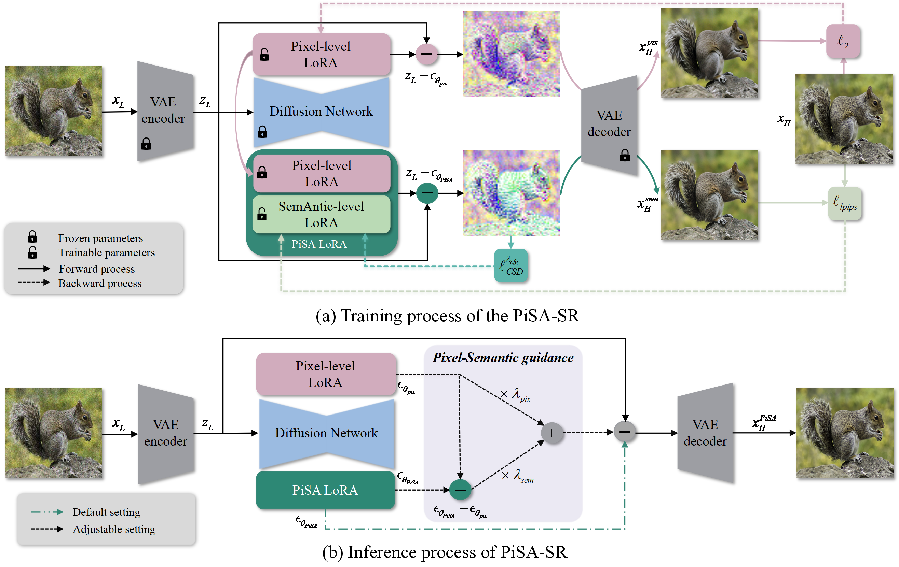


(a) Training procedure of PiSA-SR. During the training process, two LoRA modules are respectively optimized for pixel-level and semantic-level enhancement.

(b) Inference procedure of PiSA-SR. During the inference stage, users can use the default setting to reconstruct the high-quality image in one-step diffusion or adjust λ<sub>pix</sub> and λ<sub>sem</sub> to control the strengths of pixel-level and semantic-level enhancement.
## 😍 Visual Results
### Demo on Real-world SR
[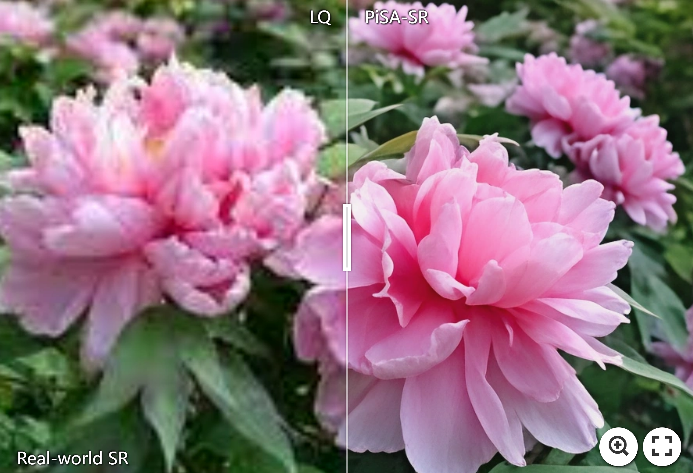](https://imgsli.com/MzM0NDE3) [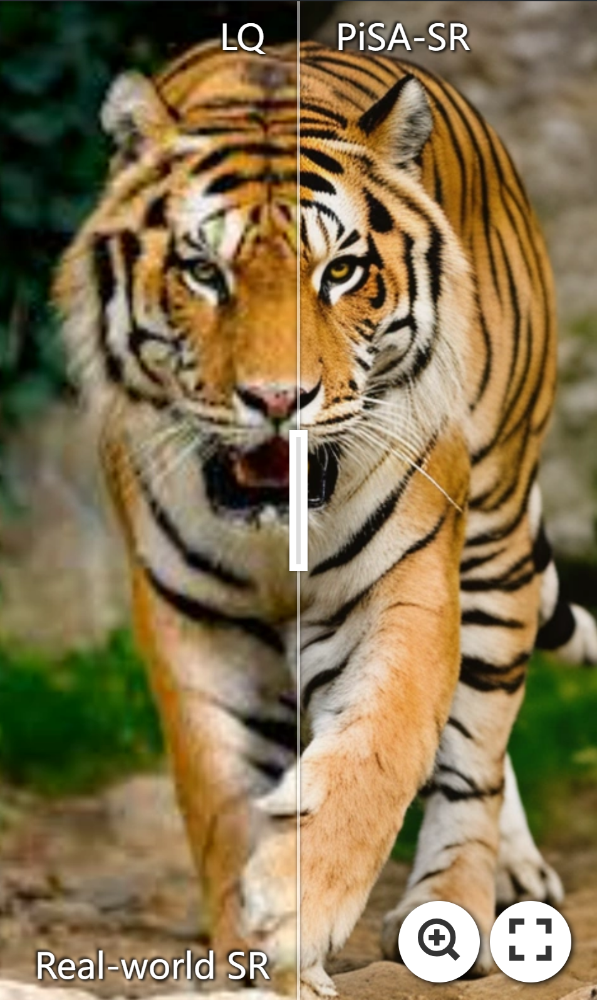](https://imgsli.com/MzM0NDIz) [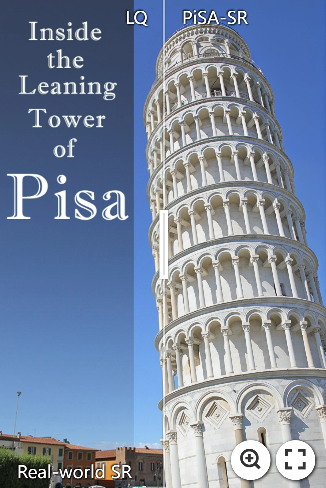](https://imgsli.com/MzM0NDIx) [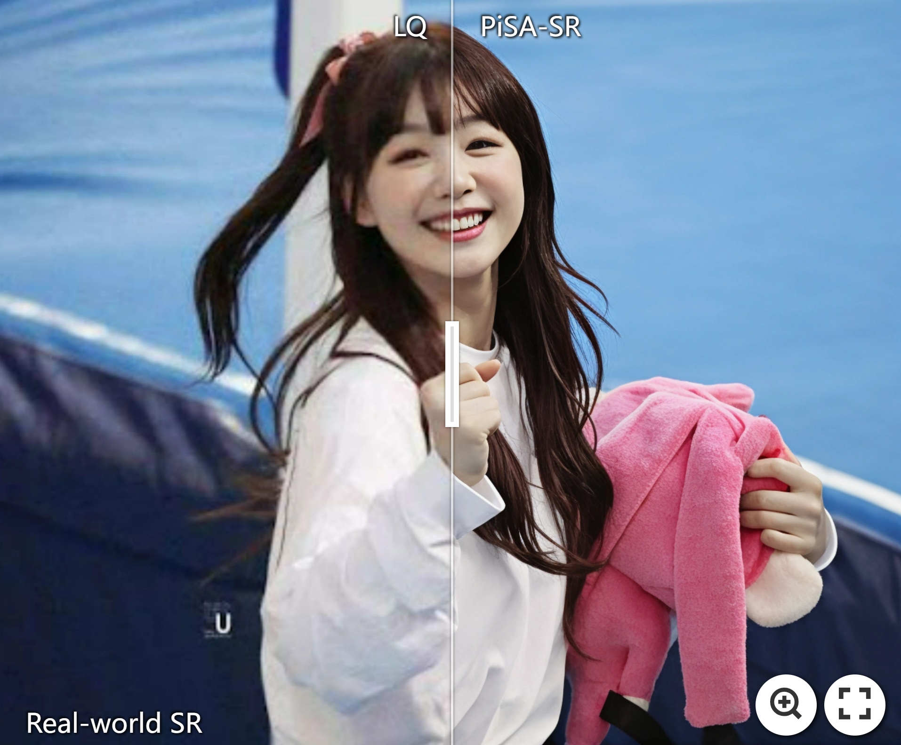](https://imgsli.com/MzM0NDI2) 

### Demo on AIGC Enhancement
[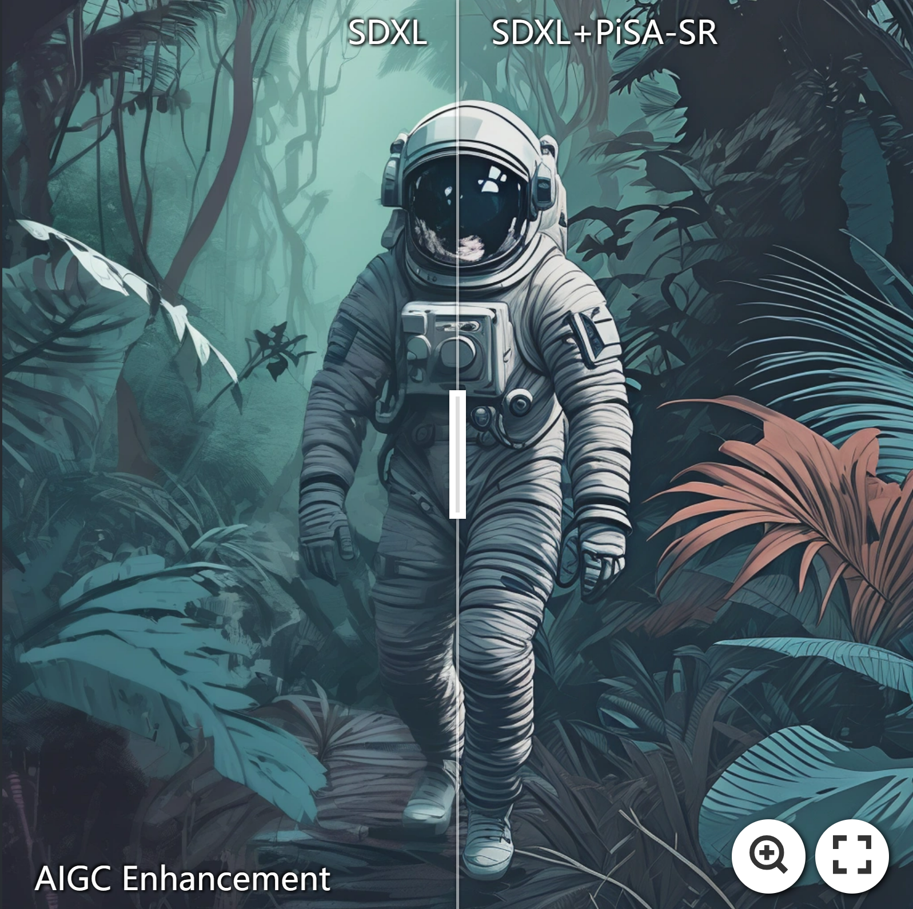](https://imgsli.com/MzM0NDI4) [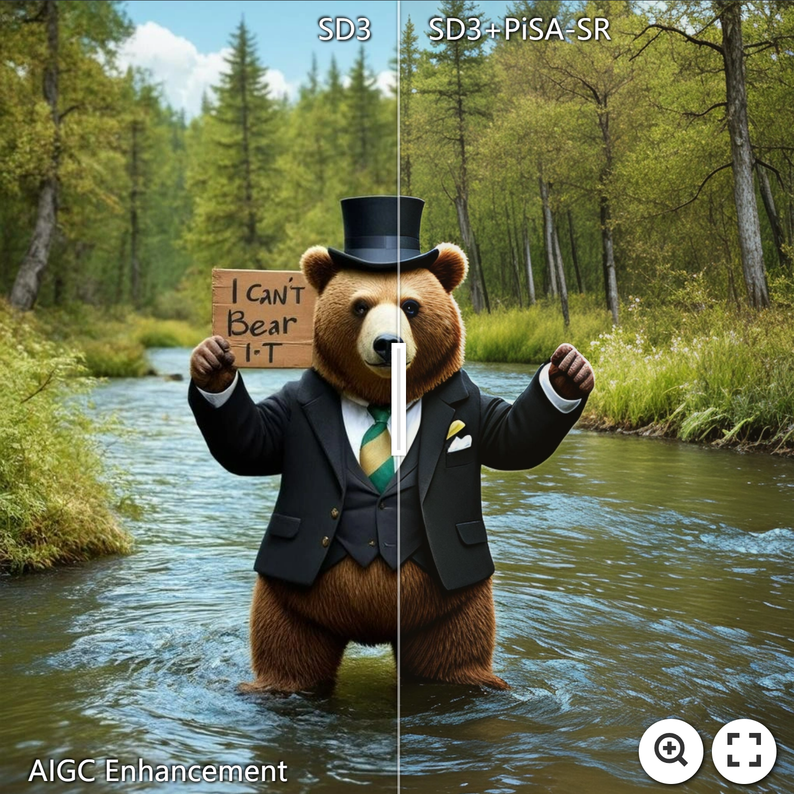](https://imgsli.com/MzM0NDMx) [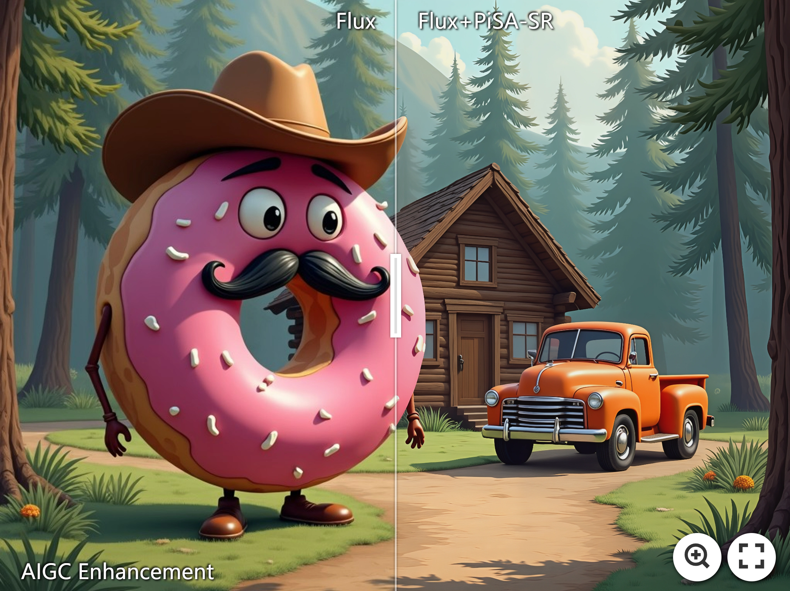](https://imgsli.com/MzM0NDM1) [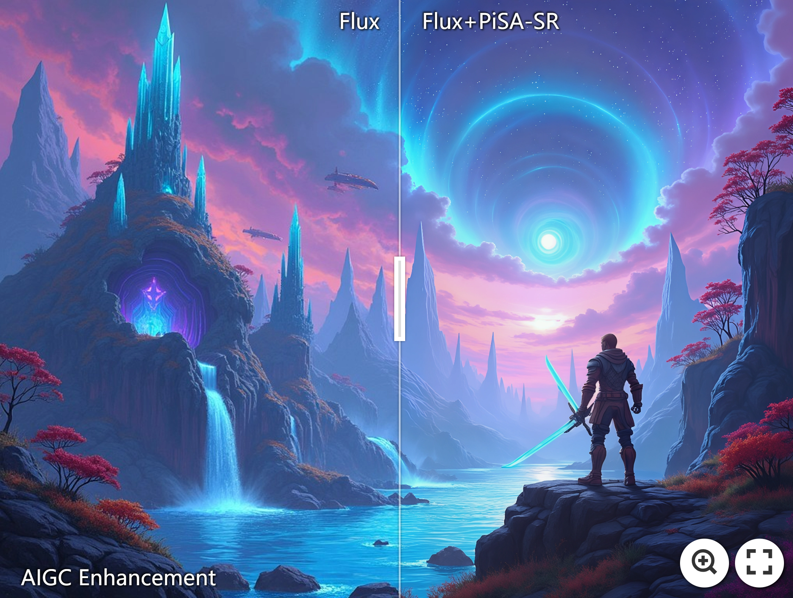](https://imgsli.com/MzM0NDM0) [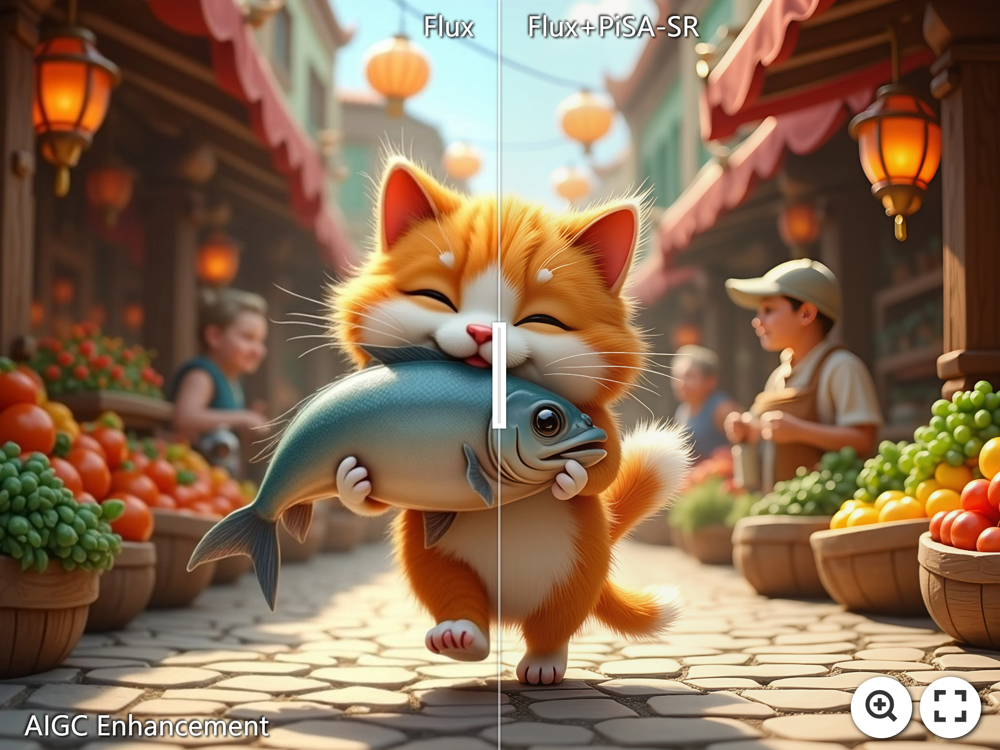](https://imgsli.com/MzM0NDM2)

### Adjustable SR Results

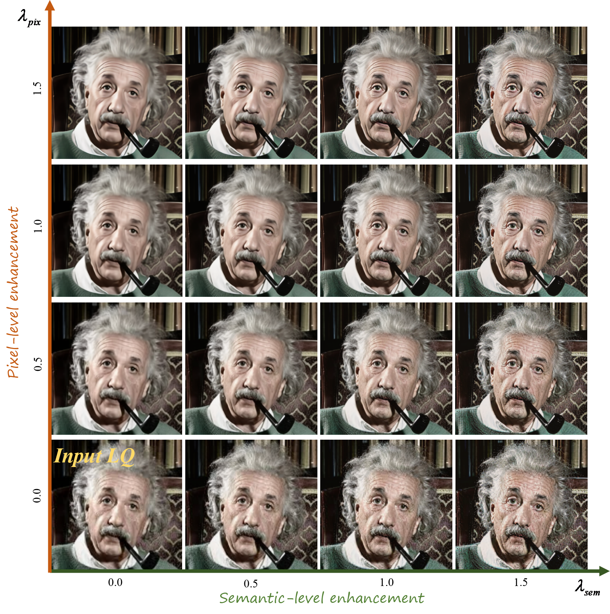


By increasing the guidance scale λ<sub>pix</sub> on the pixel-level LoRA module, the image degradations such as noise and compression artifacts can be gradually removed; however, a too-strong λ<sub>pix</sub> will make the SR image over-smoothed. By increasing the guidance scale λ<sub>sem</sub> on the semantic-level LoRA module, the SR images will have more semantic details; nonetheless, a too-high λ<sub>sem</sub> will generate visual artifacts.

### Comparisons with Other DM-Based SR Methods
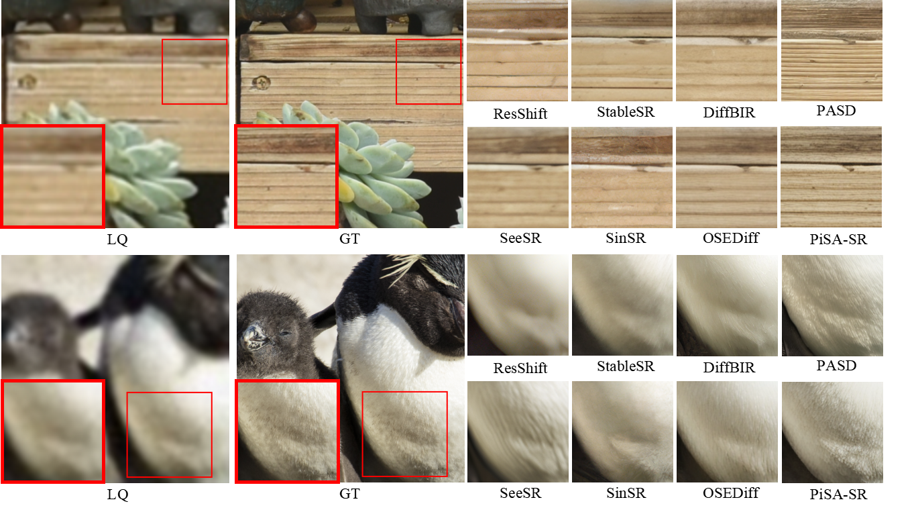

## ⚙ Dependencies and Installation
```shell
## git clone this repository
git clone https://github.com/csslc/PiSA-SR
cd PiSA-SR


# create an environment
conda create -n PiSA-SR python=3.10
conda activate PiSA-SR
pip install --upgrade pip
pip install -r requirements.txt
```

## 🍭 Quick Inference
#### Step 1: Download the pretrained models
- Download the pretrained SD-2.1-base models from [HuggingFace](https://huggingface.co/stabilityai/stable-diffusion-2-1-base).
- Download the PiSA-SR model from [`GoogleDrive`](https://drive.google.com/drive/folders/1oLetijWNd59xwJE5oU-eXylQBifxWdss?usp=drive_link) or [`BaiduNetdisk(pwd: pisa)`](https://pan.baidu.com/s/1wcMVp9vmsDrLnK0yTAH2Ig) and put the models in the `preset/models`:

#### Step 2: Prepare testing data
You can put the testing images in the `preset/test_datasets`.

#### Step 3: Running testing command 
For default setting:
```
python test_pisasr.py \
--pretrained_model_path preset/models/stable-diffusion-2-1-base \
--pretrained_path preset/models/pisa_sr.pkl \
--process_size 512 \
--upscale 4 \
--input_image preset/test_datasets \
--output_dir experiments/test \
--default
```

For adjustable setting:
```
python test_pisasr.py \
--pretrained_model_path preset/models/stable-diffusion-2-1-base \
--pretrained_path preset/models/pisa_sr.pkl \
--process_size 512 \
--upscale 4 \
--input_image preset/test_datasets \
--output_dir experiments/test \
--lambda_pix 1.0 \
--lambda_sem 1.0
```
🛠️You can adjust `lambda_pix` and `lambda_sem` to **control the strengths of pixel-wise fidelity and semantic-level details**.

We integrate [tile_diffusion](https://github.com/albarji/mixture-of-diffusers) and [tile_vae](https://github.com/pkuliyi2015/multidiffusion-upscaler-for-automatic1111/tree/main) to the [test_pisasr.py](test_pisasr.py) to save the GPU memory for inference.
You can change the tile size and stride according to the VRAM of your device.

```
python test_pisasr.py \
--pretrained_model_path preset/models/stable-diffusion-2-1-base \
--pretrained_path preset/models/pisa_sr.pkl \
--process_size 512 \
--upscale 4 \
--input_image preset/test_datasets \
--output_dir experiments/test \
--latent_tiled_size 96 \
--latent_tiled_overlap 32 \
--vae_encoder_tiled_size 1024 \
--vae_decoder_tiled_size 224 \
--default
```

### Citations
If our code helps your research or work, please consider citing our paper.
The following are BibTeX references:

```
@article{sun2024pisasr,
  title={Pixel-level and Semantic-level Adjustable Super-resolution: A Dual-LoRA Approach},
  author={Sun, Lingchen and Wu, Rongyuan and Ma, Zhiyuan and Liu, Shuaizheng and Yi, Qiaosi and Zhang, Lei},
  journal={arXiv preprint arXiv:2412.03017},
  year={2024}
}
```

### License
This project is released under the [Apache 2.0 license](LICENSE).

### Acknowledgement

### Contact
If you have any questions, please contact: ling-chen.sun@connect.polyu.hk


<details>
<summary>statistics</summary>


</details>
